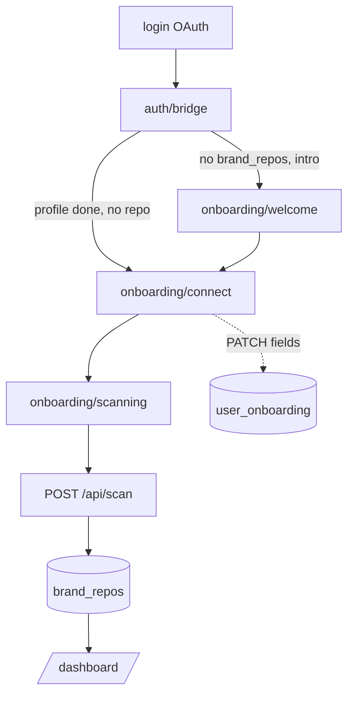
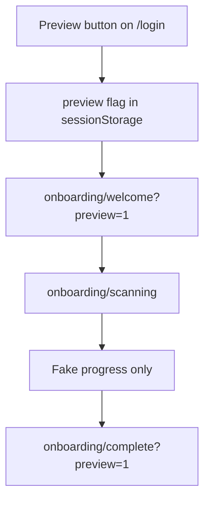

# Onboarding: technical reference

This document describes the autoDSM onboarding **wizard**, **Supabase persistence** (`user_onboarding`), and related APIs. Pair with [VERCEL_SUPABASE_CHECKLIST.md](./VERCEL_SUPABASE_CHECKLIST.md) (OAuth URLs, env) and [AUTH_GITHUB.md](./AUTH_GITHUB.md) (GitHub OAuth vs App, private repos).

## Environment matrix (local / preview / production)

| Environment | `NEXT_PUBLIC_APP_URL` | Supabase **Site URL** and **Redirect URLs** |
|---------------|-------------------------|---------------------------------------------|
| Local | `http://localhost:3000` | Add `http://localhost:3000/**` to Redirect URLs. |
| Vercel Preview | Each deploy host (e.g. `https://*.vercel.app`) | Add each preview origin you use, or a documented pattern your team allows. Mismatch causes OAuth redirect errors. |
| Production | Canonical app URL (no trailing slash) | **Site URL** = same; Redirect URLs must include `/auth/callback` on the app (Supabase also uses its own `…/auth/v1/callback` in the GitHub/Google OAuth app settings). |

`NEXT_PUBLIC_ONBOARDING_DEV_PREVIEW=1` shows the “Preview onboarding” path on the login page outside `NODE_ENV === "development"`.

## User journey (order)

| Step | Route | Purpose |
|------|--------|---------|
| 0 | — | **Legacy** `/onboarding` redirects to `/onboarding/account`. |
| 1 | `/onboarding/account` | “Create your account” — same OAuth (GitHub / Google) as `/login`. If the user is already signed in, they are sent to the profile step. In **preview** mode, redirects to `/onboarding/welcome?preview=1`. |
| 2 | `/onboarding/welcome` | Collect display name and optional website; headline uses the name. |
| 3 | `/onboarding/role` | Single role chip (e.g. Founder, Designer, …). |
| 4 | `/onboarding/team` | Team size (Solo, 2–10, 11–50, 51+). |
| 5 | `/onboarding/company` | Company name + company website. |
| 6 | `/onboarding/connect` | Pick or paste a GitHub repo; uses `GET /api/github/repos` when signed in with GitHub and a `provider_token` (not in preview). |
| 7 | `/onboarding/scanning` | Runs the scan pipeline: **authenticated** `POST /api/scan` **or** dev **preview** mode (no API, fake progress). |
| — | `/onboarding/complete` | Shown only after a **preview** scan (no dashboard session). CTA back to login. |
| — | `/onboarding/unsupported` | Unsupported-repo screen. |

Unauthenticated users can open `/onboarding/account` and sign in; after OAuth, [`/auth/bridge`](../src/app/auth/bridge/page.tsx) routes: **(1)** `autodsm.pendingRepo` in `sessionStorage` → `/onboarding/scanning`; **(2)** if `brand_repos` row exists → `/dashboard`; **(3)** if `user_onboarding.profile_completed_at` is set (company step saved) but no repo yet → `/onboarding/connect`; **(4)** else → `/onboarding/welcome`. See [`getAuthBridgePath`](../src/lib/auth/bridge-redirect.ts).

## Route map and query params

| URL | Query | Meaning |
|-----|--------|--------|
| `/login` | `mode=signup` \| `mode=login` | Swaps “Create your account” vs “Sign in” copy. |
| Any onboarding step | `preview=1` or `sessionStorage` | **Dev UI preview** — `autodsm.onboardingPreview=1` is set; scanning does not call `POST /api/scan` (avoids 401 for unauthenticated UI testing). |
| `/onboarding/scanning` | `repo`, `projectName` (optional) | `repo` is `owner/name`; `projectName` is passed to `/api/scan` when not in preview. |

`NEXT_PUBLIC_ONBOARDING_DEV_PREVIEW=1` (optional) can be used in the future to show the “Preview onboarding” control outside `NODE_ENV === "development"`.

## Client state and Supabase

- **Key:** `autodsm.onboarding.v1` in `sessionStorage` — JSON of [`OnboardingDraft`](../src/lib/onboarding/types.ts) (including `projectName`, `currentStep`).
- **Key:** `autodsm.onboardingPreview` — `"1"` when preview mode is on.
- **Context:** [`OnboardingProvider`](../src/components/onboarding/onboarding-provider.tsx) loads **`GET /api/onboarding`** on mount (non-preview), **merges server row into the draft (DB wins)**, and `commit()` **PATCHes** the server on each step with [`draftToServerPatch`](../src/lib/onboarding/persist.ts).
- **Table:** `public.user_onboarding` (migration [`20260422210000_user_onboarding.sql`](../supabase/migrations/20260422210000_user_onboarding.sql)) — 1:1 with `user_id`, RLS `auth.uid() = user_id`, row created for new `app_users` via trigger, backfill for existing users. **`profile_completed_at`** is set when the company step is saved; **`intended_repo_full_name` / `intended_project_name`** are set at connect; scan metadata: `last_scan_started_at`, `last_scan_error`.

## Server APIs (current)

### `GET` / `PATCH /api/onboarding`

- **File:** [`src/app/api/onboarding/route.ts`](../src/app/api/onboarding/route.ts)
- **Auth:** requires session; RLS on `user_onboarding`.
- **GET:** returns `{ onboarding: row | null }`.
- **PATCH:** idempotent **upsert** of wizard fields and optional `setProfileComplete`, `lastScanStarted`, `lastScanError`, `clearLastScanError`, `currentStep`.

### `POST /api/scan`

- **File:** [`src/app/api/scan/route.ts`](../src/app/api/scan/route.ts)
- **Auth:** requires Supabase user session; returns **401** if missing.
- **Body:** `{ repo: "owner/name", projectName?: string }`
- **Effect:** fetches GitHub content, runs extraction, **upserts** `brand_repos` with `BrandProfile` JSON.

### `GET /api/github/repos`

- **File:** [`src/app/api/github/repos/route.ts`](../src/app/api/github/repos/route.ts)
- **Auth:** needs Supabase session with **`provider_token`** (GitHub OAuth). If missing, response explains re-auth; user can still paste a public `owner/name`. Loads up to **3** pages of `per_page=100` and merges.

### OAuth and bridge

- [`/auth/callback`](../src/app/auth/callback/route.ts) — exchanges code, redirects to bridge.
- [`/auth/bridge`](../src/app/auth/bridge/page.tsx) — see routing rules in the “User journey” section above; queries `brand_repos` and `user_onboarding.profile_completed_at`.

## Supabase (current)

- **`app_users`** — user profile; trigger on insert ensures a **`user_onboarding`** row exists for new accounts.
- **`user_onboarding`** — full wizard state and resume fields (see migration).
- `brand_repos` — one row per connected repo, `brand_profile` JSON; bridge sends users to dashboard when a row exists.

**Optional later**

- Real-time scan progress (SSE) or background jobs. Analytics: step seen / completed. Multi-repo product UI beyond the first `brand_repos` row.

## Security and preview mode

- **Preview** must never call `POST /api/scan` in a way that bypasses auth in production. Current behavior: only when `autodsm.onboardingPreview=1` or `?preview=1` **and** the client branch is taken; keep guard server-side (scan route unchanged — still requires user).
- Do not expose **service role** or secrets to the client.
- The anon/publishable Supabase key in `NEXT_PUBLIC_*` is expected; **RLS** must protect `user_onboarding` and related tables.

## Mermaid: happy path (authenticated)

## Mermaid: dev preview path

